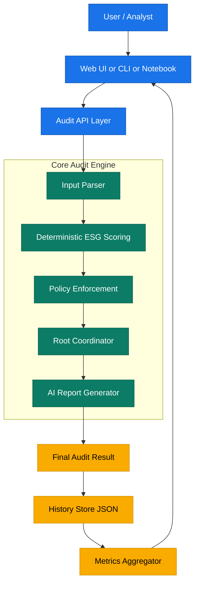
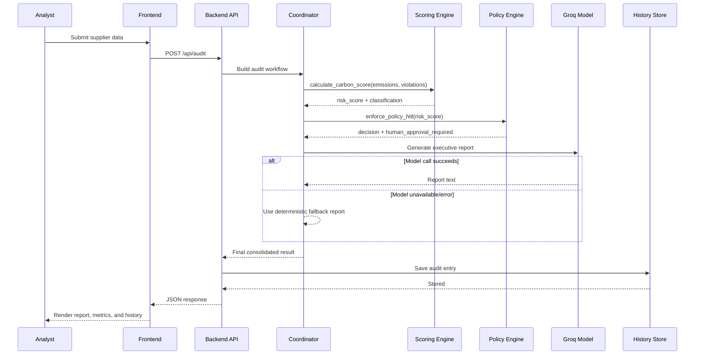

1<p align="center">
  
</p>

<h1 align="center">Carbon Footprint Optimization Engine (CfoE)</h1>
<h3 align="center">Agentic ESG Compliance for Supplier Risk Intelligence</h3>

---

## Introduction

CfoE is a multi-agent ESG audit system that helps teams evaluate supplier carbon risk faster, more consistently, and with safer decision controls. It combines deterministic scoring, policy enforcement, and AI-generated executive reporting into one workflow that can run in notebook mode, CLI mode, or via a web dashboard for interactive testing on new supplier data.

---

## Table of Contents

| #   | Section                                                       |
| --- | ------------------------------------------------------------- |
| 1   | [Title and Subtitle](#title-and-subtitle)                     |
| 2   | [Introduction](#introduction)                                 |
| 3   | [Table of Contents](#table-of-contents)                       |
| 4   | [Features](#features)                                         |
| 5   | [Tech Stack and Prerequisites](#tech-stack-and-prerequisites) |
| 6   | [Diagram](#diagram)                                           |
| 7   | [Project Structure](#project-structure)                       |
| 8   | [User Instructions](#user-instructions)                       |
| 9   | [Developer Instructions](#developer-instructions)             |
| 10  | [Contributor Expectations](#contributor-expectations)         |
| 11  | [Known Issues](#known-issues)                                 |
| 12  | [Made With](#made-with)                                       |

---

## Title and Subtitle

| Item     | Value                                                 |
| -------- | ----------------------------------------------------- |
| Project  | Carbon Footprint Optimization Engine (CfoE)           |
| Subtitle | Agentic ESG Compliance for Supplier Risk Intelligence |

---

## Features

| Feature                       | What it Gives You                                   |
| ----------------------------- | --------------------------------------------------- |
| Multi-Agent Pipeline          | Structured flow from monitoring to final report     |
| Deterministic Risk Scoring    | Stable and auditable ESG scores for the same inputs |
| Policy Enforcement            | Automatic action routing based on risk thresholds   |
| HITL Safety Gate              | High-risk cases marked for human review             |
| AI Reporting                  | Executive summaries and recommendations             |
| Web Dashboard                 | Submit, compare, and track audits interactively     |
| Audit Info Modal              | Inspect full details for any selected history audit |
| Multi-Format Output Export    | Per-job exports in JSON/TXT/MD/HTML/CSV/PDF/DOCX    |
| Local History Store           | Persist previous audits for analysis                |
| Notebook + Script + Web Modes | Flexible usage based on workflow preference         |

---

## Tech Stack and Prerequisites

### Tech Stack

| Layer         | Technology                            | Purpose                                  |
| ------------- | ------------------------------------- | ---------------------------------------- |
| Language      | Python 3.10+                          | Core implementation                      |
| AI SDK        | groq                                  | LLM content generation                   |
| Web API       | FastAPI                               | Backend endpoints for audits and metrics |
| Web Server    | Uvicorn                               | Local ASGI server                        |
| Frontend      | HTML, CSS, JavaScript                 | Interactive dashboard UI                 |
| Export Engine | reportlab, python-docx                | PDF and DOCX generation                  |
| Configuration | python-dotenv                         | Environment variable loading             |
| Storage       | JSON file (`data/audit_history.json`) | Local audit history                      |

### Prerequisites

| Requirement         | Notes                                |
| ------------------- | ------------------------------------ |
| Python 3.10+        | Verified with local venv setup       |
| Groq API Key        | Set `GROQ_API_KEY` in `.env`         |
| Internet access     | Needed for live model calls          |
| Virtual environment | Recommended for dependency isolation |

---

## Diagram

### System Architecture



### Audit Flow (Detailed)



---

## Project Structure

```text
CO2 footprint/
├── agents/
│   ├── calculation_agent.py
│   ├── monitor_agent.py
│   ├── policy_agent.py
│   └── reporting_agent.py
├── orchestrators/
│   └── root_coordinator.py
├── web/
│   ├── index.html
│   └── static/
│       ├── app.js
│       └── styles.css
├── data/
│   └── audit_history.json
├── outputs/
│   ├── audits_master.csv
│   └── job-<job_id>/
│       ├── aud-<audit_id>.json
│       ├── aud-<audit_id>.txt
│       ├── aud-<audit_id>.md
│       ├── aud-<audit_id>.html
│       ├── aud-<audit_id>.csv
│       ├── aud-<audit_id>.pdf
│       └── aud-<audit_id>.docx
├── docs/
│   └── README.md
├── webapp.py
├── main.py
├── main_simple.py
├── global-cfoe.ipynb
├── requirements.txt
└── README.md
```

---

## User Instructions

### Option A: Web Dashboard (Recommended)

1. Activate virtual environment.
2. Install dependencies: `pip install -r requirements.txt`
3. Start app: `uvicorn webapp:app --reload`
4. Open: `http://127.0.0.1:8000`
5. Submit supplier data and review:
   - risk score and class
   - policy decision
   - report text
   - history and comparison view
6. Click a history row to auto-fill form inputs from that audit.
7. Use the **Info** button in history rows to:
   - view complete audit metadata and report details
   - open the single **Download Files** action for format selection

### Option B: CLI Script

1. Ensure `.env` contains `GROQ_API_KEY`.
2. Run: `python main.py`
3. Review example low/moderate/critical outputs in terminal.

### Option C: Notebook

1. Open `global-cfoe.ipynb`.
2. Run cells in order.
3. Use evaluation and observability sections for deeper validation.

---

## Developer Instructions

### Setup

| Step               | Command                           |
| ------------------ | --------------------------------- |
| Create venv        | `python -m venv venv`             |
| Activate (Windows) | `venv\Scripts\activate`           |
| Install deps       | `pip install -r requirements.txt` |
| Run smoke test     | `python test_setup.py`            |
| Run app            | `uvicorn webapp:app --reload`     |

### Environment

Create `.env` in project root:

```env
GROQ_API_KEY=your_groq_api_key_here

# Optional: Tavily Search API for external risk monitoring
TAVILY_API_KEY=your_tavily_api_key_here
```

### Dev Notes

- Core deterministic logic lives in `agents/calculation_agent.py` and `agents/policy_agent.py`.
- Groq configuration and client setup in `config/groq_config.py`.
- Coordinator and report orchestration live in `orchestrators/root_coordinator.py`.
- Frontend consumes REST endpoints exposed by `webapp.py`.and report orchestration live in `orchestrators/root_coordinator.py`.
- Frontend consumes REST endpoints exposed by `webapp.py`.

---

## Contributor Expectations

| Area          | Expectation                                                       |
| ------------- | ----------------------------------------------------------------- |
| Code style    | Follow PEP 8 and keep logic readable                              |
| Changes       | Keep patches focused and minimal                                  |
| Testing       | Validate with `python test_setup.py` and one manual dashboard run |
| Documentation | Update READMEs when behavior changes                              |
| Safety logic  | Do not weaken risk threshold logic without clear rationale        |
| PR quality    | Include summary, screenshots (for UI), and test evidence          |

---

## Known Issues

| Issue                      | Impact                                               | Current Handling                                               |
| -------------------------- | ---------------------------------------------------- | -------------------------------------------------------------- |
| Model/API unavailability   | AI report may fail                                   | Falls back to deterministic report text                        |
| Local JSON storage         | Not multi-user or cloud-safe                         | Suitable for local demos and testing                           |
| Monitor agent parity       | Web path currently emphasizes deterministic pipeline | Notebook has fuller ADK-style demonstrations                   |
| No auth on local dashboard | Local-only security profile                          | Intended for development environments                          |
| Browser-specific handling  | Download/Open behavior can differ by browser         | Dedicated backend routes separate download and inline PDF view |

---

## Made With

Made With 💗 by Team Bankrupts
